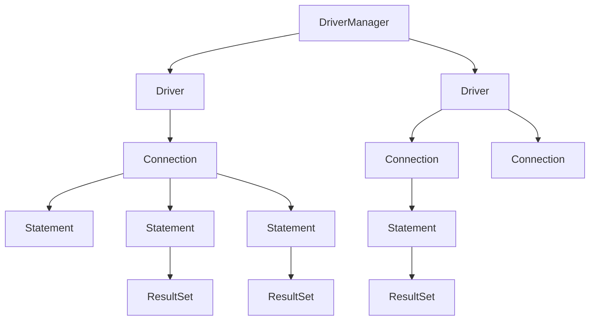

###  JDBC的API结构和使用流程

<!-- more -->
### 创建Statement的方式

* `Statement  stmt = Connection.createStatement(......);`

  * 执行不带参数的简单SQL语句

* `PreparedStatement  pstmt = Connection.prepareStatement(......);`

  * 执行带参数或不带参数的SQL语句
  
* `CallableStatement   cstmt  =  Connection.prepareCall(...);`
  * 执行对数据库已存储的PL/SQL程序的调用
***
### 执行SQL语句
* `executeQuery()`：执行查询语句，返回查询结果集 `ResultSet`
  返回结果集 `rs.getFetchSize()`记录着当前返回数量的大小：`10`
* `executeUpdate()`: 执行DML和DDL 语句，返回int类型
* `execute()`: 执行任何SQL语句，返回boolean类型，指示是否有ResultSet返回
  