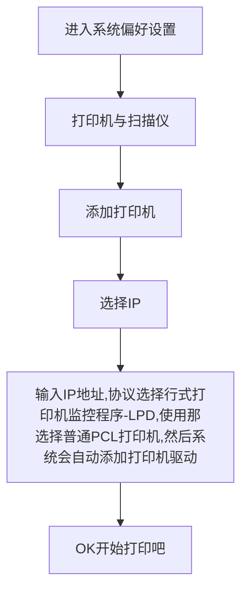

```mermaid
graph TB
    A0[进入系统偏好设置] --> B0[打印机与扫描仪] --> C0[添加打印机] -->  D0[选择IP]
    D0[选择IP]  --> E0[ 输入IP地址,协议选择行式打印机监控程序-LPD,使用那选择普通PCL打印机,然后系统会自动添加打印机驱动]  --> F0[OK开始打印吧] 
```
1. 进入系统偏好设置。
2. 打印机与扫描仪
3. 添加打印机
4. 选择IP
5. 输入IP地址，协议选择“行式打印机监控程序-LPD”，使用那选择“普通PCL打印机”，然后系统会自动添加打印机驱动。
6. OK开始打印吧
***
就是这么简单